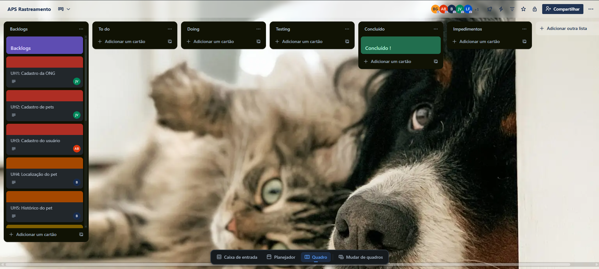
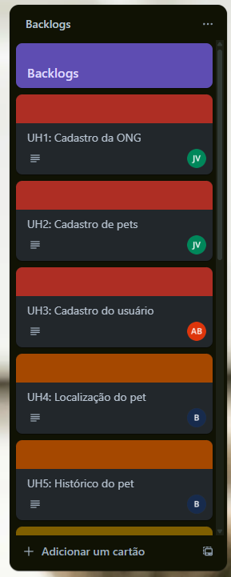

# Patas da Rua

**Equipe:**
- [Anna Beatriz dos Santos Silva](https://github.com/Anninhaxs)
- [Bento Guilherme Gomes Oliveira](https://github.com/bnnto)
- [Bruno Ferreira de Andrade Lyra](https://github.com/BrunoFerreiraLyra)
- [João Victor Castelo Branco de Sena](https://github.com/joao0cb)
- [Lettycia Vitoria Melo de França](https://github.com/LettyciaDev)
- [Lorenna Meneses de Almeida](https://github.com/lorennam)

---
# 🐾 Aplicação Web de Rastreamento de Animais de Rua

## 🌟 Visão Geral
Muitas ONGs enfrentam um desafio crítico: a **falta de espaço** para acolher todos os cães e gatos abandonados nas ruas. Sem proteção, esses animais ficam vulneráveis. Nosso projeto propõe uma solução: **coleiras com rastreadores** que permitem monitorar a localização desses animais em tempo real através de um site dedicado.

Com essa tecnologia, as ONGs podem:
- **Gerenciar cuidados** aos animais não abrigados.
- Facilitar o **apadrinhamento**, permitindo que pessoas se responsabilizem financeiramente, mesmo à distância.
- **Apoiar adoções**, conectando animais rastreados a possíveis adotantes.

## 🎯 Objetivo
Proteger e melhorar a qualidade de vida de animais de rua, oferecendo uma solução tecnológica que:
- **Reduz o abandono** ao monitorar e cuidar de animais fora dos abrigos.
- **Amplia o alcance das ONGs**, conectando-as com a comunidade para apadrinhamento e adoção.
- **Facilita a localização** desses animais.

## 💡 Como Funciona?
1. **Rastreamento**: Animais de rua recebem coleiras com rastreadores GPS.
2. **Monitoramento**: A localização é exibida para a instituição em tempo real em um site acessível.
3. **Gestão de Cuidados**: ONGs acompanham os animais e organizam apadrinhamentos e adoções.
4. **Adoção Facilitada**: Pessoas podem apadrinhar e adotar animais rastreados.

## 🐕‍🦺 Impacto Esperado
- **Animais protegidos**, mesmo sem espaço nas ONGs.
- **Comunidade engajada** no apadrinhamento e adoção.
- **Redução do abandono** e melhoria na qualidade de vida animal.

# Trello

### Quadro

### Backlog

